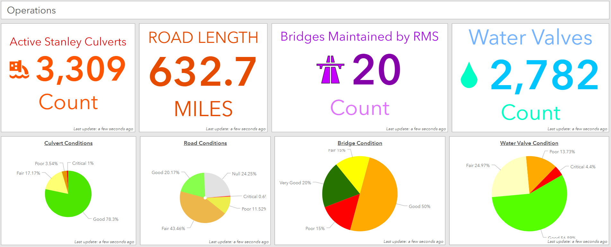

# Ryan Hildebrand's Portfolio

Welcome to my GitHub portfolio! Here you'll find a collection of my projects, skills, and experiences. I'm passionate about data analysis, GIS, remote sensing, and agriculture. Feel free to explore my repositories and reach out if you have any questions or collaboration opportunities.

## About Me

I am a skilled data analyst with a background in GIS, remote sensing, and agriculture. I have experience in project management, spatial data analysis, and business data analysis. I am always eager to learn new skills and take on challenges.

## Skills

- **Programming Languages:** Python, R, SQL, VBA
- **Remote Sensing:** Satellite imagery analysis, image classification, land use/land cover mapping, photogrammetry
- **Data Analysis and Visualization:** Power BI, Tableau, Excel
- **Data Engineering:** FME data pipelines, ETL processes
- **Project Management:** Task management, planning, execution
- **Software:** ArcGIS, QGIS, ESRI Location Platform, FME, Microsoft Office Suite, Monday.com, Git, SiteScan

## Experience

### GIS and Fiber Optics Specialist
**Valley Fiber**  
*Worked on GIS analysis and fiber optics projects, including spatial data management and network design.*

- Managed GIS data for fiber optic network projects.
- Developed tools and scripts for automating GIS tasks using Python and VBA.
- Built and maintained FME data pipelines for efficient data processing and integration.
- Coordinated with teams to ensure accurate and efficient data handling.

### GIS Tech
**Rural Municipality of Stanley**  
*Focused on land use planning, municipal infrastructure, and rural development projects.*

- Conducted spatial analysis and mapping for municipal planning and development.
- Assisted in the creation and maintenance of a comprehensive GIS database.
- Supported infrastructure projects with GIS-based data collection and analysis.
- Created interactive dashboards using Power BI for visualizing municipal data trends.
- Collaborated with municipal staff to ensure compliance with local regulations and standards.

### Agronomist / Farm Management Intern
**Agriculture and Agri-Food Canada (AAFC)**  
*Gained hands-on experience in farm management, crop monitoring, and agricultural data collection.*

- Assisted in field data collection and analysis.
- Supported farm management activities and planning.
- Collaborated with researchers to analyze agricultural trends and data, including remote sensing data for crop health monitoring.

## Projects

### [Fiber Management ETL Automation](https://github.com/yourusername/fiber-management-etl)
*Automated the process of converting and integrating spatial data from various formats for fiber management systems.*

- **Technologies:** Python, ArcGIS, FME
- **Summary:** Developed an ETL (Extract, Transform, Load) process to handle data conversion and integration for fiber management systems. This involved extracting spatial data from CAD and KMZ formats, adding necessary attribution, validating and modifying geometries, and importing the cleaned and formatted data into fiber management systems. The process ensured data consistency and accuracy, improving overall efficiency in managing fiber optic network projects.

### [Infrastructure and Asset Management Dashboard](https://github.com/yourusername/infrastructure-dashboard)
*Aggregated data for infrastructure and asset management planning, focusing on fiber optics and municipal projects.*

- **Technologies:** Power BI, SQL, Tableau, ArcGIS Dashboards
- **Summary:** Developed a solution for aggregating data from various databases to support infrastructure and asset management planning for fiber optic networks and municipal projects in the Rural Municipality of Stanley. The process involved extracting and consolidating data from multiple sources, ensuring data consistency and accuracy, and creating interactive dashboards using Power BI and ArcGIS Dashboards. These dashboards provided valuable insights into asset management and infrastructure planning, enhancing decision-making and operational efficiency.

### [Remote Sensing for Drainage and Culvert Planning](https://github.com/yourusername/remote-sensing-drainage-culvert)
*Advanced remote sensing analysis for drainage planning and culvert asset management.*

- **Technologies:** Python, ArcGIS, Remote Sensing Software, DJI Mavic Drones, SiteScan Photogrammetry Software
- **Summary:** Applied advanced remote sensing techniques, including multispectral and LiDAR analysis, using DJI Mavic drones and SiteScan photogrammetry software to determine optimal drainage plans and extract culvert assets. The project involved using digital elevation models (DEMs) and high-resolution multispectral imagery to analyze hydrological patterns, perform terrain analysis, and conduct culvert sizing and placement analysis. This data was integrated into GIS for creating detailed drainage models and assessing culvert infrastructure, aiding in effective water management and infrastructure planning.

## Education

**Bachelor of Environmental Studies**  
*Focus in Land Management, Minor in Soil Science*  
University of Manitoba, 2020  

## Certifications

- **Drone License Certification** - Canada Small Drones
- **Esri Python for Everyone Certification** - Esri
- **Esri ArcGIS Pro Essentials Certification** - Esri

## Contact

- **Email:** [ryanhildebrand@hotmail.ca](mailto:ryanhildebrand@hotmail.ca)
- **LinkedIn:** [Ryan Hildebrand](https://www.linkedin.com/in/ryan-hildebrand-419b97255/)
- **GitHub:** [Your GitHub Profile](https://github.com/yourusername)

---

Feel free to reach out if you'd like to collaborate or if you have any questions about my work. I'm always open to new opportunities and challenges!

